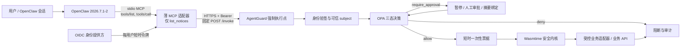

# OpenClaw 接入判断与基础版说明

> 项目：AgentGuard 政企智能体权限、审批、阻断与安全内核原型
> 结论日期：2026-08-20
> 基础版范围：仅开放一个低风险、只读的内部公告查询工具

## 一、结论摘要

本组系统原来没有可由 OpenClaw 直接消费的标准 MCP Server，主要入口是 AgentGuard 的 REST 强制执行端点和内部 Python 模块，因此原始系统不能“零改造”接入。当前已经增加一个薄型 stdio MCP 适配器；它不复制权限和业务逻辑，只把固定的 `list_notices` 调用转换为 AgentGuard `POST /invoke` 请求。基于当前仓库版本，OpenClaw 已可直接注册该适配器，不需要修改 AgentGuard 核心。

基础版开发难度评定为**低**，且已完成实机注册与工具发现。OpenClaw 2026.7.1-2（提交 `0790d9f`）实际完成了 `mcp set`、`doctor --probe` 和 `mcp probe`，发现唯一工具 `agentguard-notices__list_notices`，相关进程退出码均为 0。另有一次确定性 MCP `tools/call` 调用了真实本机 AgentGuard、OPA、一次性票据、Wasmtime 和隔离测试公告 SQLite，返回 2 条记录且 `side_effect=false`。

证据边界必须保持清楚：OpenClaw 的 `probe` 实际建立了 MCP 会话并执行工具发现，但它本身不执行 `tools/call`；低风险调用由项目内的确定性 MCP 协议客户端完成，不是 OpenClaw 模型回合。由于没有获批的模型凭据，当前不得表述为“OpenClaw 模型已自主调用工具”。

## 二、系统接口盘点

| 接口类型 | 当前情况 | 能否直接交给智能体 | 结论 |
|---|---|---:|---|
| MCP | 已新增 `integrations/openclaw_mcp`，使用 stdio JSON-RPC，当前仅暴露 `list_notices` | 是，限当前只读工具 | 这是推荐入口 |
| REST / OpenAPI | AgentGuard 提供 `POST /invoke`，另有 `/healthz`、`/readyz`、`/version`；当前没有正式 OpenAPI 描述文件 | REST 可由适配器调用，不应让模型自由拼接请求 | MCP 适配器固定调用 `/invoke` |
| SDK | 有内部 Python 类，如 `EnforcementGateway`、身份验证、票据、审批和业务适配器 | 否 | 属于进程内实现，不是跨系统稳定接口；直接导入还可能扩大旁路面 |
| CLI | 有 `python -m service` 及测试、演示、评测脚本 | 不推荐 | CLI 适合运维和复现，不应直接变成模型可调用的任意命令 |
| 消息队列 | 未发现 Kafka、RabbitMQ 等业务接入面 | 否 | 当前不需要 MQ 适配器 |
| 数据库 | SQLite 用于测试公告、测试付款账本、票据、审批状态和审计检查点 | 绝对不能直接暴露 | 只能经受限业务 API 或 AgentGuard 工具适配器访问 |
| GUI / RPA | 未发现正式 GUI/RPA 业务入口 | 否 | 后续若只有 GUI/RPA，应先建设受限业务 API 和审批流，不能让智能体直接操作界面 |

## 三、九项接入判断

| 序号 | 问题 | 结论 |
|---:|---|---|
| 1 | 能否零改造直接接入 | **原始系统不能；当前版本可以。**原来只有 REST/内部 Python，需要增加 MCP 适配层。现在适配器已经完成，OpenClaw 可直接注册；AgentGuard 核心没有为此改写。 |
| 2 | 不能直连时需要什么适配层 | 一个薄型 stdio MCP Server：只处理 MCP 握手、`tools/list`、`tools/call`、参数白名单和响应裁剪，然后固定调用 AgentGuard `/invoke`。策略、审批、签票、执行和审计仍由 AgentGuard 负责。 |
| 3 | 推荐 MCP、插件还是其他方式 | **接口层首选 MCP。**基础版直接使用 stdio MCP；生产多用户场景仍以 MCP 为业务接口，可增加一个很薄的 OpenClaw 原生插件，仅负责 requester-scoped 身份到 MCP 连接的绑定，不在插件内复制业务或安全逻辑。不要直接暴露 SDK、CLI、数据库或 RPA。 |
| 4 | 如何传递可信用户身份 | 生产使用每用户短时 OIDC/OAuth Bearer，经 HTTPS/mTLS 送到 AgentGuard；令牌由运维侧文件、秘密管理系统或 requester-scoped 连接解析器注入，不能作为工具参数交给模型。AgentGuard 验证签名、issuer、audience、有效期、角色、部门、密级和 MFA 后，用可信 claims 整体覆盖请求中的占位 `subject`。当前实测使用的是仅限 IP 回环地址的静态测试身份，不是生产身份。 |
| 5 | 是否包含副作用 | 当前 MCP 工具只有公告查询，业务副作用为否；但 AgentGuard 整体具有或规划了查询、写入、删除、付款、发布、外发、导出、命令执行和部署等动作类型。当前真实实现的业务适配器是公告读取和隔离测试付款记账；删除、发布和运维等仅完成策略/审批/阻断建模，未接生产后端。审计、票据核销和检查点会产生内部安全状态写入。 |
| 6 | 是否必须经过 AgentGuard | **必须。**即使是低风险查询，也要经过可信身份、OPA 决策、适配器注册检查、动作摘要、短时一次性票据、安全内核和审计；高风险动作还必须先暂停并取得绑定 `task_id + 完整 action` 摘要的审批凭证。MCP 客户端的只读提示只是提示，不能代替服务端强制控制。 |
| 7 | 是否存在旁路 | 代码中的 MCP 适配器自身没有数据库或业务凭据，只能调用 `/invoke`；但部署层仍可能出现旁路：OpenClaw 自带 shell/浏览器/文件工具、业务数据库或 API 的直连网络、把生产凭据放到 Agent 主机、直接导入内部 SDK/业务适配器、误启开发身份、暴露 OPA 管理面或工具后端端口。生产必须通过工具白名单、网络策略、mTLS、凭据隔离和后端票据核销封死这些路径。 |
| 8 | 基础版开发难度 | **低，已完成。**原因是已有稳定 REST 强制执行点，只需做窄参数和窄响应的协议转换。若扩展到每用户身份、远程高可用 MCP、审批交互和写操作，难度为中到高。 |
| 9 | 生产化还缺什么 | 每用户短时 OIDC/OAuth 与撤销/轮换、HTTPS/mTLS、Requester 与会话强绑定、OpenClaw 模型回合实测、OpenClaw 内置工具收敛、后端网络零旁路、真实业务凭据与授权脱敏数据、AgentGuard/OPA/OpenBao 高可用、跨故障域部署、并发与故障注入、审计对账/SIEM、证书和制品供应链治理。 |

## 四、为什么选择 MCP

选择 MCP 的核心原因不是“接口更流行”，而是它最容易保持现有安全边界：

1. OpenClaw 官方已经提供 `mcp.servers` 注册、工具过滤、`doctor` 和 `probe`，基础接入不需要改 OpenClaw 内核。
2. MCP 的工具名、输入 JSON Schema、输出 Schema 和只读提示可以限制模型看到的能力；本基础版唯一参数是 `limit`，取值只允许 1 到 100。
3. 薄适配器不拥有数据库、付款凭据或策略决定权。即使 MCP 层被诱导，它仍只能提交固定的公告查询候选动作，由 AgentGuard 再次决定是否执行。
4. MCP 可被 OpenClaw 之外的其他标准客户端复用，减少对单一智能体框架的绑定。
5. 原生插件更适合补充 OpenClaw 专属的用户身份上下文、界面或生命周期管理。生产多用户场景可以用插件的 requester-scoped MCP connection resolver，把 OpenClaw 可信的请求者身份映射为该用户自己的短时令牌；插件仍不应绕过 AgentGuard 直接完成业务操作。

因此推荐路线是：**MCP 承载受控工具协议，AgentGuard 作为唯一策略执行点；仅在需要 OpenClaw 可信请求者上下文时，再增加一个身份连接插件。**

## 五、最小架构图



基础版实测时没有生产 IdP：身份从运维侧静态 JSON 文件注入，并被强制限制在 IP 字面量回环地址。这只用于本机测试，不能沿用到远程或生产部署。

## 六、可信身份与副作用边界

### 6.1 身份传递

生产身份链建议如下：

1. OpenClaw 从已认证消息通道取得可信请求者，而不是相信提示词中自报的姓名或角色。
2. 每名请求者使用独立、短时、最小 scope 的 OIDC/OAuth access token；多用户不得共享一个高权限服务账号令牌。
3. 令牌放在受限文件、SecretRef/秘密管理系统或 requester-scoped resolver 中，只注入 MCP 传输头；模型看不到令牌，也不能通过 `tools/call.arguments` 修改令牌。
4. AgentGuard 独立验证 JWT，并用验签 claims 重建 `subject`。MCP 请求体中的 `unverified-mcp-placeholder` 没有权限；如果身份覆盖未发生，请求应默认失败。
5. 审批人身份与发起人身份分离，高风险审批凭证绑定具体任务和动作摘要，并限制有效期和使用次数。

当前 stdio 基础版适合单用户/单会话测试。若一个 OpenClaw Gateway 同时服务多名用户，优先采用 OpenClaw 官方 requester-scoped MCP connection resolver，或为每名用户建立独立 MCP 进程和独立令牌，不能让多个用户共用同一个静态 token 文件。

### 6.2 副作用清单

| 能力 | 当前 MCP 是否暴露 | 当前实现状态 | AgentGuard 要求 |
|---|---:|---|---|
| 查询内部公告 | 是 | 真实读取隔离测试 SQLite；本次返回 2 条，`side_effect=false` | 仍需身份、OPA、票据、安全内核和审计 |
| 写入一般业务数据 | 否 | 已有策略与审批测试场景，未接生产业务后端 | 接入前必须新增窄业务 API、审批、幂等和对账 |
| 删除 | 否 | 已完成风险建模和审批/阻断规则，未实现生产删除适配器 | 默认不开放；必须显式审批并提供可恢复机制 |
| 付款 | 否 | 隔离 SQLite 测试账本可在有效审批后记一笔；预生产 HTTPS 适配器有双重开关 | 强制审批、金额上限、幂等键、一次性票据和结果不确定时对账 |
| 发布 / 外发 | 否 | 策略层覆盖，未接真实发布系统 | 必须审批、目标白名单、内容检查和审计 |
| 运维 / 命令 / 部署 | 否 | 策略和沙箱测试覆盖，未开放给 MCP | 不得直接暴露 CLI/shell；需要专用受限 API、审批和原生隔离 |
| 审计、票据、审批状态 | 不作为工具暴露 | AgentGuard 会写审计日志、核销票据并保存审批状态 | 属于安全控制所需内部状态，需 HA、备份和留存治理 |

## 七、基础版代码与功能

| 文件 | 功能 |
|---|---|
| `integrations/openclaw_mcp/server.py` | MCP 握手、协议版本协商、`tools/list`、`tools/call`；只注册 `list_notices`，校验 `limit` 并裁剪输出字段 |
| `integrations/openclaw_mcp/agentguard_client.py` | 只允许调用固定 AgentGuard `/invoke`；禁用系统代理和 HTTP 重定向；设置超时和响应大小上限 |
| `integrations/openclaw_mcp/config.py` | 校验 AgentGuard 地址、HTTPS/回环边界、OIDC 或测试身份、CA 和令牌文件；危险配置启动即拒绝 |
| `integrations/openclaw_mcp/__main__.py` | stdio MCP Server 启动入口，标准输出只写协议帧，不打印配置或秘密 |
| `integrations/openclaw_mcp/protocol_probe.py` | 确定性执行 `initialize`、`tools/list` 和低风险 `tools/call`，保存输入、输出、版本和退出码 |
| `integrations/openclaw_mcp/openclaw-config.example.json` | OpenClaw `mcp.servers.agentguard-notices` 的生产方向示例配置 |
| `integrations/openclaw_mcp/dev-subject.example.json` | 仅供 IP 回环本机测试的低权限静态身份样例 |
| `integrations/openclaw_mcp/tests/test_mcp_server.py` | 参数越界、身份边界、远程明文、未知工具、错误响应、stdio 等专项测试 |
| `scripts/run_openclaw_mcp_e2e.py` | 启动真实本机 AgentGuard 与常驻 OPA，调用 OpenClaw CLI 完成注册/探针，再执行低风险协议调用并汇总证据 |

适配器的关键收敛点如下：

- 模型只能提交 `{"limit": 1..100}`，不能提交 `subject`、`tool`、`operation`、`resource`、审批结果或 AgentGuard 地址。
- 工具固定映射为 `database.query/query` 和 `db://public/notices`。
- 远程 AgentGuard 必须使用 HTTPS；HTTP 只允许 IP 字面量回环地址。
- 返回结果只保留公告 `id`、`title`、`department`、`published_at`，不返回执行票据、动作摘要、JTI 或内部配置。
- 只有 AgentGuard 返回 `executed_isolated` 且业务结果明确标记 `side_effect=false` 时，MCP 才返回成功；其他情况均 fail-closed。

## 八、示例配置

仓库中的完整示例见 `integrations/openclaw_mcp/openclaw-config.example.json`。生产方向的最小结构如下，尖括号内容必须由部署方提供，不能把真实秘密提交到 Git：

```json
{
  "mcp": {
    "servers": {
      "agentguard-notices": {
        "command": "<PROJECT_ROOT>\\.venv\\Scripts\\python.exe",
        "args": ["-m", "integrations.openclaw_mcp"],
        "cwd": "<PROJECT_ROOT>",
        "env": {
          "AGENTGUARD_MCP_BASE_URL": "https://agentguard.internal.example",
          "AGENTGUARD_MCP_IDENTITY_MODE": "oidc",
          "AGENTGUARD_MCP_TOKEN_FILE": "<SECURE_PER_USER_TOKEN_FILE>",
          "AGENTGUARD_MCP_CA_BUNDLE": "<INTERNAL_CA_PEM>"
        },
        "connectionTimeoutMs": 8000,
        "requestTimeoutMs": 20000,
        "supportsParallelToolCalls": false,
        "toolFilter": {
          "include": ["list_notices"]
        }
      }
    }
  }
}
```

`toolFilter` 是 OpenClaw 侧的第一层收敛；MCP Server 代码本身只注册一个工具，AgentGuard 的注册表和 OPA 又各自形成独立的服务端门禁。因此即使 OpenClaw 配置误放宽，也不会自动得到写入、付款或运维能力。

## 九、测试报告与证据边界

### 9.1 实测环境与结果

| 项目 | 实测结果 |
|---|---|
| OpenClaw | `OpenClaw 2026.7.1-2 (0790d9f)` |
| Node.js | `v24.19.0` |
| OPA | `1.19.0` |
| Python | `3.12.13` |
| MCP 适配器 | `0.1.0` |
| MCP 协议 | `2025-11-25`，同时兼容代码列出的旧版本 |
| MCP 适配器专项测试 | 11/11 通过，包含真实 stdio 子进程、越权参数与错误状态对抗测试 |
| OpenClaw 注册 | `mcp set agentguard-notices` 成功，退出码 0 |
| OpenClaw 静态诊断与实连 | `doctor --probe --json` 返回 `ok=true`，退出码 0 |
| OpenClaw 工具发现 | `probe --json` 发现且只发现 `agentguard-notices__list_notices`，无 diagnostics，退出码 0 |
| 低风险调用 | 确定性 MCP 客户端执行 `tools/call list_notices(limit=2)`，返回 2 条测试公告，`side_effect=false`，退出码 0 |
| AgentGuard 链路 | readiness 通过；OPA canary、签名和票据状态均健康；审计记录为 `database.query/query`、`G000_EXECUTED`，未记录票据值 |
| 汇总检查 | 9/9 通过，状态 `passed_with_declared_scope` |

### 9.2 可以与不可以使用的表述

可以写：

> OpenClaw 2026.7.1-2 已在测试机完成 MCP Server 实机注册、`doctor --probe` 和 `tools/list`；一个只读公告工具已由确定性 MCP 协议客户端调用真实 AgentGuard 测试链并成功返回，业务副作用为否。

不可以写：

> OpenClaw 模型已经自主调用 AgentGuard 工具，或已经完成生产接入。

原因是当前未配置获批的模型凭据，没有运行 OpenClaw agent 模型回合；实测身份是回环静态测试身份，数据是隔离合成公告，且 `production_ready=false`。

### 9.3 证据文件

| 文件 | 内容 |
|---|---|
| `reports/openclaw_mcp_integration.json` | 主证据：每一步命令、版本、开始时间、耗时、输入、输出、stderr、退出码、检查项和证据边界 |
| `reports/openclaw_mcp_integration.md` | 主证据的中文摘要 |
| `reports/openclaw_mcp_protocol_probe.json` | 独立协议兼容证据；明确标注 `openclaw_runtime_used=false` |

主报告已经对项目路径、临时目录和临时测试秘密做占位替换，且 `secret_values_recorded=false`。命令证据中的低风险调用与 OpenClaw 探针也分开保存，避免混淆证据来源。

## 十、旁路风险与未完成项

| 风险或缺口 | 当前状态 | 生产要求 |
|---|---|---|
| OpenClaw 内置 shell、浏览器、文件等工具可能绕过 AgentGuard | 本基础版只收敛新增 MCP 工具，不能自动接管 OpenClaw 的其他工具 | 在 OpenClaw 与运行环境同时使用 allowlist/sandbox；生产 Agent 不授予能直连业务系统的通用工具 |
| 业务 API/数据库直连 | 适配器代码不含数据库连接，但部署网络尚未形成单位级证明 | 后端只接受 AgentGuard 票据或 mTLS 身份；用 NetworkPolicy/防火墙关闭其他来源 |
| 共享静态 token 导致身份混同 | 本次仅使用回环静态测试身份 | 使用 requester-scoped 短时 OIDC/OAuth；按用户/会话隔离连接，支持撤销与轮换 |
| OpenClaw 模型回合未测试 | 未配置获批模型凭据 | 在隔离测试环境运行一次真实 agent 回合，保存提示、工具选择、调用结果和退出状态 |
| 真实业务凭据与数据 | 未提供，当前为隔离合成公告和测试付款账本 | 经授权提供最小权限凭据与脱敏数据，完成读取、审批写入、失败回滚和审计对账 |
| 写入、删除、发布、运维 MCP 工具 | 未开放，这是有意的安全边界 | 每个动作单独建窄工具、固定资源范围、独立审批规则、幂等/补偿机制和负面测试 |
| 高可用与跨故障域 | 基础版为本机测试链 | AgentGuard、OPA、OpenBao、身份服务和审计存储跨故障域部署，验证故障切换和一致性 |
| TLS/mTLS 与证书轮换 | 示例已预留 CA，当前实测为回环 HTTP | 生产强制内部 CA、mTLS、证书轮换、主机白名单和无重定向 |
| 直接导入 SDK 或启动测试适配器 | 仓库中存在演示/测试入口 | Agent 主机不安装生产业务凭据；生产镜像只包含批准入口，并通过网络与部署权限禁止测试入口 |
| 供应链与版本升级 | OpenClaw 实测版本已固定为 2026.7.1-2 | 固定版本/哈希、生成 SBOM、扫描依赖；升级 OpenClaw 或 MCP 协议后重新执行全部契约和 E2E 测试 |

## 十一、复现命令

以下命令在仓库根目录的 PowerShell 中运行。完整 E2E 会使用临时状态目录和临时测试秘密，启动真实本机 AgentGuard 与常驻 OPA，完成 OpenClaw 注册、探针和低风险调用，并自动清理服务。

### 11.1 MCP 适配器专项测试

```powershell
.\.venv\Scripts\python.exe -m unittest discover `
  -s .\integrations\openclaw_mcp\tests `
  -p 'test_*.py' -v
```

### 11.2 OpenClaw 实机注册、探针与 AgentGuard 低风险调用

```powershell
$nodeCommand = Get-Command node.exe -ErrorAction SilentlyContinue
$nodeExe = if ($nodeCommand) {
  $nodeCommand.Source
} else {
  (Resolve-Path "$env:USERPROFILE\.cache\codex-runtimes\codex-primary-runtime\dependencies\node\bin\node.exe").Path
}
$pnpmExe = (Resolve-Path "$env:USERPROFILE\.cache\codex-runtimes\codex-primary-runtime\dependencies\bin\fallback\pnpm.cmd").Path
$runtimeDir = '.\third_party\runtime\openclaw-client'
$openclawEntry = (Resolve-Path `
  "$runtimeDir\node_modules\openclaw\openclaw.mjs" `
  -ErrorAction SilentlyContinue).Path

if (-not $openclawEntry) {
  $env:Path = "$(Split-Path $nodeExe);$env:Path"
  & $pnpmExe add --dir $runtimeDir --ignore-workspace `
    --allow-build=openclaw `
    --allow-build=protobufjs `
    --allow-build=tree-sitter-bash `
    --allow-build='@google/genai' `
    openclaw@2026.7.1-2
  if ($LASTEXITCODE -ne 0) { throw 'OpenClaw 隔离安装失败' }
  $openclawEntry = (Resolve-Path `
    "$runtimeDir\node_modules\openclaw\openclaw.mjs").Path
}

.\.venv\Scripts\python.exe .\scripts\run_openclaw_mcp_e2e.py `
  --node $nodeExe `
  --openclaw-entry $openclawEntry

$LASTEXITCODE
```

上述安装目录位于已被 Git 忽略的 `third_party/runtime/`，不会改写全局 OpenClaw
配置；固定版本为本次实测的 `2026.7.1-2`。如果既没有系统 Node.js，也不在
Codex 桌面环境中，请先按 OpenClaw 官方安装说明准备受支持的 Node.js。
成功时脚本退出码为 0，并生成：

```text
reports/openclaw_mcp_integration.json
reports/openclaw_mcp_integration.md
```

### 11.3 查看 OpenClaw 注册与实时工具发现

在已有测试配置的环境中，可单独复核：

```powershell
& $nodeExe $openclawEntry --version
& $nodeExe $openclawEntry mcp show agentguard-notices --json
& $nodeExe $openclawEntry mcp doctor agentguard-notices --probe --json
& $nodeExe $openclawEntry mcp probe agentguard-notices --json
```

预期 `probe` 仅返回：

```text
agentguard-notices__list_notices
```

### 11.4 独立协议兼容测试

先启动启用了本地测试业务适配器的 AgentGuard，然后执行：

```powershell
$env:AGENTGUARD_MCP_BASE_URL = 'http://127.0.0.1:8080'
$env:AGENTGUARD_MCP_IDENTITY_MODE = 'loopback_static_dev'
$env:AGENTGUARD_MCP_DEV_SUBJECT_FILE = `
  (Resolve-Path '.\integrations\openclaw_mcp\dev-subject.example.json').Path

.\.venv\Scripts\python.exe -m integrations.openclaw_mcp.protocol_probe `
  --limit 2 `
  --report .\reports\openclaw_mcp_protocol_probe.json

$LASTEXITCODE
```

该命令只应称为“协议兼容测试”，因为报告会明确记录 `openclaw_runtime_used=false`。

## 十二、官方资料

- [OpenClaw 官方 MCP CLI 文档](https://docs.openclaw.ai/cli/mcp)：说明 `mcp.servers`、`set/add`、`doctor --probe` 和 `probe`；官方同时明确 `probe` 用于建立连接并列出能力。
- [OpenClaw 2026.7.1-2 发布页](https://github.com/openclaw/openclaw/releases/tag/v2026.7.1-2)：本次实测固定版本。
- [OpenClaw 2026.7.1-2 固定提交](https://github.com/openclaw/openclaw/commit/0790d9f593ad30c940ed93b5872a8cf6d6f3cf8c)：用于定位实测代码版本。
- [OpenClaw requester-scoped MCP connections](https://docs.openclaw.ai/plugins/sdk-overview#requester-scoped-mcp-connections)：生产多用户场景中，使用可信请求者上下文为每个用户解析独立 MCP 传输和令牌。
- [OpenClaw 官方安全边界](https://docs.openclaw.ai/gateway/security)：部署时收敛工具、凭据、网络和运行环境的依据。
- [MCP 2025-11-25 Tools 规范](https://modelcontextprotocol.io/specification/2025-11-25/server/tools)：`tools/list`、`tools/call`、输入/输出 Schema 和工具注解的协议依据。
- [OpenID Connect Core 1.0](https://openid.net/specs/openid-connect-core-1_0.html)：AgentGuard 生产可信用户身份传递与 claims 验证的标准依据。

## 十三、最终判断

本组系统接入 OpenClaw 的**基础版已经完成**：OpenClaw 能实际注册和发现一个只读 MCP 工具，该工具只能通过 AgentGuard 执行，协议低风险调用也已贯通真实本机安全链。当前成果适合做课题演示、接口验证和后续扩展基线。

当前成果**不是生产完成**：尚未运行有真实模型凭据的 OpenClaw agent 回合，尚未使用真实用户 OIDC、生产业务凭据或生产数据，也尚未在单位网络中证明所有直连路径都被封闭。后续应先完成 requester-scoped 身份、网络零旁路和真实只读业务验证，再逐个评估是否开放写入、付款、发布或运维工具。
