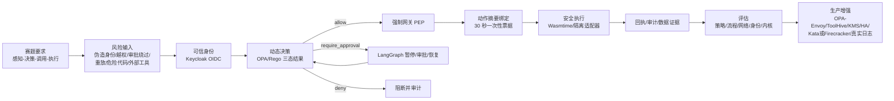

# AgentGuard 开源路线自动推进总览

> 更新日期：2026-08-14
> 本文不是 PPT 方案，而是后续研究、实现、测试和材料沉淀的统一执行基线。

## 0. 一句话总路线

围绕赛题要求的“感知—决策—调用—执行”全流程安全，采用 **Keycloak 可信身份 + OPA 动态策略 + LangGraph 人工审批 + 强制网关/一次性票据 + Wasmtime 受限执行** 形成当前可复现闭环；再沿 **OPA-Envoy、ToolHive、KMS/高可用状态库、Kata/Firecracker、真实脱敏数据回放** 向生产级方案推进。

## 1. 整体大图（后续所有工作共用）

### 大图的口头语言

系统不相信智能体自己说“可以执行”。请求必须先证明身份，再由外部策略判断；高风险动作必须停下来由人审批；真正执行前还要取得与本次动作绑定、短时且一次性的票据；最终代码只能在受限环境中运行。任何一层失败都默认拒绝，并留下可追踪证据。

## 2. 赛题解读：题目怎样转化为工程任务

赛题第二项明确要求围绕文件操作、系统命令、数据库读写和接口调用等高风险动作，研究细粒度权限约束、动态策略校验、关键操作审批和异常任务阻断；同时要求形成可复现的原型、代码、实验方法、指标体系与评估数据。

| 赛题关键词 | 需要解决的真实问题 | 当前实现抓手 | 验证证据 |
|---|---|---|---|
| 感知 | 不能相信请求里的自报身份 | Keycloak 签名 JWT；覆盖不可信 JSON subject；审批人身份同样验签 | OIDC E2E 7/7 |
| 决策 | 角色、密级、金额、资源和环境共同决定权限 | OPA/Rego 三态决策：allow / require_approval / deny | 31/31 单元测试；55/55 场景 |
| 调用 | 高风险动作不能直接进入工具 | LangGraph 持久化暂停；审批绑定任务和动作摘要 | 审批流程 10/10；9 条流程定义 |
| 执行 | 模型或调用方不能绕过策略直连后端 | 网关 fail-closed；短时 HMAC 票据；原子核销 | 网络 E2E 5/5；重放/直连阻断 |
| 安全内核 | 恶意或失控代码需要最后一道资源边界 | Wasmtime 禁止主机导入，限制内存和燃料 | 无限循环/WASI/内存等内核测试 |
| 可评估 | 不能只展示“能跑”，还要证明“为什么可信” | 分层数据、原因码、回执、副作用断言、覆盖率和耗时 | 83 条测试定义；40 个 Python 测试；15 个演示检查 |

## 3. 开源技术路线与 Why Choose

### 3.1 当前直接集成的主路线

| 环节 | 选择 | 为什么选择 | 横向比较后的结论 | 我们新增的部分 |
|---|---|---|---|---|
| 可信身份 | [Keycloak](https://github.com/keycloak/keycloak) | 支持 OIDC/SAML、JWT、角色/组织声明、身份代理和后续目录联邦；适合政企统一身份入口 | 自行签 JWT 缺少身份生命周期和联邦能力；云厂商 IAM 会增加平台绑定。Keycloak 可本地部署，适合原型与后续内网化 | 严格校验 issuer、audience、签名、MFA、部门、密级；签名身份覆盖请求自报身份 |
| 动态策略 | [OPA](https://github.com/open-policy-agent/opa) | 通用策略即代码，引擎与业务解耦，输入可使用任意 JSON 上下文，适合工具、金额、密级、网络区等复合条件 | [Casbin](https://github.com/apache/casbin) 很适合 ACL/RBAC/ABAC 授权库，但本课题还需要跨工具风险规则、原因码、审批三态和网关/Envoy扩展；Cedar类型化授权清晰，但本原型更看重通用策略与跨栈集成 | 三态结果、硬拒绝优先、原因码、动作摘要、审计脱敏和55条策略数据 |
| 人工审批 | [LangGraph](https://github.com/langchain-ai/langgraph) | `interrupt`、checkpointer 和 `thread_id` 能直接支持智能体图中的暂停、恢复与状态持久化 | 普通 Web 审批表单不能自然保存 Agent 轨迹；Temporal更适合生产级长流程和故障恢复，但部署复杂度更高。原型阶段选 LangGraph，生产可评估 Temporal | 审批凭证绑定任务/动作摘要；防自批、跨任务、篡改；恢复后再次过 OPA |
| 运行时隔离 | [Wasmtime](https://github.com/bytecodealliance/wasmtime) | 可嵌入、可限制燃料和Store资源；不提供WASI/主机函数时能力面小；适合将可Wasm化适配器做细粒度隔离 | 普通子进程隔离较弱；容器能覆盖更多程序，但共享宿主内核。当前先以Wasm证明资源与能力约束，原生程序后续升级到Kata/Firecracker | 主机导入拒绝、2 MiB内存限制、燃料预算、入口白名单、统一原因码 |

### 3.2 强制执行与MCP治理的扩展路线

| 项目 | 目标位置 | 当前状态 | 选用理由 | 完成判据 |
|---|---|---|---|---|
| [OPA-Envoy](https://github.com/open-policy-agent/opa-envoy-plugin) | 网络代理层 ext_authz | Rego策略4/4；容器E2E未运行 | 把策略执行点放到服务入口，减少业务代码遗漏或旁路 | Linux/Docker中真实 Envoy→OPA→服务；无授权直连失败；mTLS与NetworkPolicy证据齐全 |
| [ToolHive](https://github.com/stacklok/toolhive) | MCP服务器注册、隔离、权限与审计 | v0.28.3 CLI/校验和已验证；容器未运行 | 官方项目提供容器化MCP运行、身份/策略、网络隔离和可观察性，适合第三方工具治理 | 有容器运行时；至少一个MCP服务完成注册、权限最小化、越权阻断和审计回放 |
| [Temporal](https://github.com/temporalio/temporal) | 生产级长流程候选 | 仅调研 | 可在故障后恢复工作流，适合跨天审批、补偿事务和高可用 | 与LangGraph做故障恢复、运维复杂度、吞吐和迁移成本对比后再决定 |
| [Kata Containers](https://github.com/kata-containers/kata-containers) / [Firecracker](https://github.com/firecracker-microvm/firecracker) | 原生程序和浏览器隔离 | 未实现 | 独立Guest Kernel或microVM提供比共享内核容器更强的隔离 | Linux/KVM测试机完成危险原生工具、文件、网络和资源边界验证 |

## 4. 复现效果、首次问题与补充结果

### 4.1 2026-08-13 自动回归结果

| 验证项 | 最新结果 | 能证明什么 | 不能证明什么 |
|---|---:|---|---|
| OPA/Rego单元测试 | 31/31 | 已定义规则分支符合预期 | 不代表制度规则已经覆盖所有单位 |
| OPA策略数据 | 55/55；危险误放行0 | 当前合成集三态与原因码全部命中 | 不能外推为生产准确率 |
| Python安全测试 | 60/60 | 身份、审批、网关、适配器、容器后端票据校验、内核和接入控制回归通过 | 不等于外部生产系统E2E |
| OPA-Envoy策略 | 4/4 | ext_authz输入规则正确 | 未运行真实Envoy容器链路 |
| 网络强制链路 | 5/5 | OPA REST→网关→受保护后端，直连/故障默认阻断 | 目前是本机双端口HTTP，不是mTLS集群 |
| Keycloak/OIDC | 7/7 | 真实服务签名令牌、缺失令牌、真实字节篡改、身份覆盖、审批人身份和签名审批 | 当前仍是HTTP开发测试域 |
| 演示检查 | 21/21 | 主要允许、暂停、拒绝、篡改、重放、签名审批、KMS/共享账本、Raft故障切换和原生隔离路径可复现 | 不是未知攻击或压力测试 |
| OpenBao外部密钥/共享核销 | 10/10 | 票据/审批独立密钥外置、轮换、双网关共享状态和两组32路并发核销 | 正式部署仍需组织级KMS策略 |
| OpenBao三节点Raft HA | 8/8 | 三节点加入、voter晋升、选主、复制、停主节点后切换及安全链路存活 | 同机测试不等于跨故障域生产部署 |
| QEMU原生隔离 | 11/11 | 独立Linux来宾内核、Alpine用户态、只读启动介质、无网络/宿主目录及资源限制 | 不是Kata/Firecracker产品E2E |
| 纯Rego基准 | 约0.345-0.367 ms/op | 策略本身为亚毫秒级量级 | 不是整个业务链路延迟 |
| OPA CLI逐例评测 | 最新值由自动看板刷新 | 一键脚本在本测试机的端到端耗时 | 含进程启动，不能当成sidecar决策延迟 |

### 4.2 本轮发现并修复的问题

**问题：JWT篡改测试存在偶发假阴性。**

- 首次完整回归在 Keycloak 阶段得到 4/5；“篡改令牌阻断”未命中。
- 原因不是JWT验证器接受了真实错误签名，而是测试构造只替换最后一个Base64url字符。受未使用填充位影响，字符变化可能仍解码为相同签名字节，因此没有真正改变签名。
- 修复为：解码JWT签名段，翻转一个真实字节，再重新Base64url编码。
- 增加 `test_signature_tamper_changes_decoded_bytes` 回归测试。
- 单项复测 Keycloak 7/7；随后完整一键回归通过，Python测试增至60。

这个问题说明安全测试不能只观察“字符串看起来变化”，必须验证底层语义或字节确实变化。

## 5. 评估框架与 Data Support

### 5.1 数据组成

| 数据层 | 文件 | 数量 | 用途 |
|---|---|---:|---|
| 策略层 | `datasets/agent_guard_cases.jsonl` | 55 | allow / require_approval / deny、原因码和非法审批 |
| 审批层 | `datasets/approval_workflow_cases.jsonl` | 9 | 批准、拒绝、修改、篡改、自批、跨任务和恢复 |
| 执行层 | `datasets/enforcement_kernel_cases.jsonl` | 19 | 票据、网关、审计、完整链路和Wasmtime攻击 |
| 合计 | 三组分层定义 | 83 | 不能合并称为“83/83模型准确率” |

所有数据目前都是合成场景，不含真实个人信息。55条策略数据的实际混淆矩阵为：预期allow 22条全部allow，预期require_approval 12条全部require_approval，预期deny 21条全部deny。

### 5.2 必须长期跟踪的指标

1. **安全性**：危险动作阻断率、非法审批阻断率、无票据直连阻断率、票据重放阻断率、危险动作误执行数。
2. **可用性**：合法动作放行率、需审批动作正确路由率、误阻断率、恢复成功率。
3. **可解释性**：原因码准确率、审计核心字段完整率、敏感字段脱敏率。
4. **鲁棒性**：OPA/身份服务故障下fail-closed率、并发票据唯一消费率、重复业务副作用率、进程重启恢复率。
5. **性能**：纯策略P50/P95、常驻服务P50/P95、完整审批链时延、吞吐、资源占用。
6. **覆盖度**：代码/策略覆盖率、工具类型覆盖、风险类别覆盖、真实日志覆盖、未知攻击覆盖。

### 5.3 下一轮数据补充顺序

1. 加入中文编码混淆、参数拆分、跨步骤权限升级和工具描述注入。
2. 加入100/500/1000并发的票据消费与审批恢复测试。
3. 加入OPA、Keycloak、数据库和网络抖动的故障注入。
4. 在取得授权后，引入脱敏网关日志和制度目录进行回放；训练/调参数据与最终测试集严格分离。
5. 对生产候选架构单独统计常驻服务延迟，停止用CLI逐次启动数据代表线上性能。

## 6. 自动推进任务板

| 阶段 | 任务 | 当前状态 | 输出证据 | 下一动作 |
|---|---|---|---|---|
| A 赛题对齐 | 形成“题目—风险—实现—指标”矩阵 | 已完成 | 本文第2节 | 后续代码变更必须映射到矩阵 |
| B 当前原型 | 完整一键回归 | 已完成 | 31/31、55/55、60/60、网络5/5、身份7/7、OpenBao10/10、Raft HA 8/8、QEMU11/11、综合检查21/21 | 每次变更自动回归并保留时间戳 |
| C 测试质量 | 修复JWT篡改测试假阴性并验证审批人身份 | 已完成 | 新增回归测试；Keycloak 7/7 | 生产补真实OTP/WebAuthn和错误aud/iss实服E2E |
| D 网络产品化 | OPA-Envoy容器E2E | 受环境阻塞 | 当前仅策略4/4 | 需要Linux+Docker/Podman预生产机 |
| E MCP治理 | ToolHive容器实测 | 受环境阻塞 | CLI和SHA-256已验证 | 需要容器运行时和测试MCP服务 |
| F 状态与密钥 | 外部密钥与共享票据/审批状态 | HA测试级完成 | OpenBao Transit+KV 10/10；三节点Raft故障切换8/8 | 生产补跨故障域、TLS、自动解封和恢复演练 |
| G 原生隔离 | 独立来宾内核实验 | 测试级完成 | QEMU Linux guest 11/11 | Kata/Firecracker仍需Linux/KVM测试机 |
| H 真实评估 | 脱敏日志回放与红队 | 等待数据授权 | 当前83条合成定义 | 建立脱敏、标注、隔离和数据许可流程 |
| I 交付 | 团队远程GitHub仓库 | 缺失 | 只有本地工程 | 创建/提供真实仓库URL并提交代码、许可证、复现说明和报告 |

## 7. 可直接执行的下一步

### 在当前Windows测试机上

- 增加实服JWT `exp/iss/aud` 异常E2E用例。
- 增加并发、故障注入和重复业务副作用测试。
- 为每次自动测试生成带时间戳的机器可读总表和趋势数据。
- 完善公开仓库结构、依赖锁定、SBOM、第三方许可证和安全说明。

### 需要新增环境或授权后

- Linux/Docker：OPA-Envoy和ToolHive容器E2E、mTLS、NetworkPolicy。
- Linux/KVM：Kata/Firecracker原生程序隔离。
- 预生产凭据：真实ERP/政务API适配器、幂等键、补偿事务和故障注入。
- 脱敏数据许可：真实日志回放、盲测集和红队评估。

## 8. 当前边界

- 可以说“当前定义的合成危险场景误执行0次”，不能说“系统绝对安全”。
- 可以说“隔离SQLite测试账本产生了真实可回滚副作用”，不能说“完成真实银行转账”。
- 可以说“OPA-Envoy策略已测试、ToolHive CLI已验证”，不能说“两个产品已完成容器部署”。
- 可以说“Wasmtime覆盖Wasm工具”，不能把它描述成浏览器、Shell和原生程序的完整操作系统隔离。
- 83是三层测试定义数量，不是可以直接相加的准确率分母。

## 9. 资料来源

- 赛题PDF：`XA-202620 面向政企场景的大模型智能体安全关键技术研究(1).pdf`
- OPA官方文档：https://www.openpolicyagent.org/docs
- Keycloak OIDC文档：https://www.keycloak.org/securing-apps/oidc-layers
- LangGraph中断文档：https://langchain-ai.github.io/langgraph/concepts/breakpoints/
- Wasmtime Store/Fuel文档：https://docs.wasmtime.dev/api/wasmtime/struct.Store.html
- ToolHive官方仓库：https://github.com/stacklok/toolhive
- Casbin官方仓库：https://github.com/apache/casbin
- Temporal官方文档：https://docs.temporal.io/
- Kata Containers官方仓库：https://github.com/kata-containers/kata-containers
- Firecracker官方仓库：https://github.com/firecracker-microvm/firecracker
